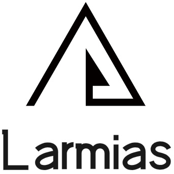

     
    
     

## 简介

Larmais一个现代化高性能常驻内存的php开发框架，支持多引擎容器如 Workerman、Swoole等引擎容器，支持HTTP Server、WebSocket、TCP Server、UDP Server 以及多进程等功能。遵循PSR设计规范，采用依赖注入设计，确保支持 `可替换` 和 `可复用` 的特性，引擎驱动设计理念使切换容器只需切换对应驱动即可完成底层引擎的切换。

## 请帮忙 Star 一下

- https://github.com/larmdcm/larmias

## 项目由来

这个框架其实一开始源自于在学习Socket编程的路上自写了一个`PHP`网络开发框架`WorkerS`（类WorkerMan，支持http，websocket协议）然后想开发一个web开发框架来和这个socket框架组合起来（有点像现在workerman和webman的关系），后来觉得既然都在写了不如写全点顺便研究研究其它PHP开发框架的编程思想，然后便一发不可收拾起来，在往后的时间中慢慢完善了起来，这个框架也不能说是完全自研可以说是参考了各大框架的思想再按照自己的想法组合起来，也算是站在巨人的肩膀上吧！（不要说我抄袭Q_Q！）那么在php开发框架百家齐放的今天，为什么还要再造一个框架使用呢？答案当然是我自己开发用得爽就行！

## 设计理念

**Larmias（拉米亚斯）**

- 对于简单，简洁的API设计和易于理解的接口，尽最大努力做到`全的轻量化`。
- 对于高效，常驻内存设计，采用事件循环模型，充分利用操作系统的多进程能力，处理并发任务，避免阻塞和等待。